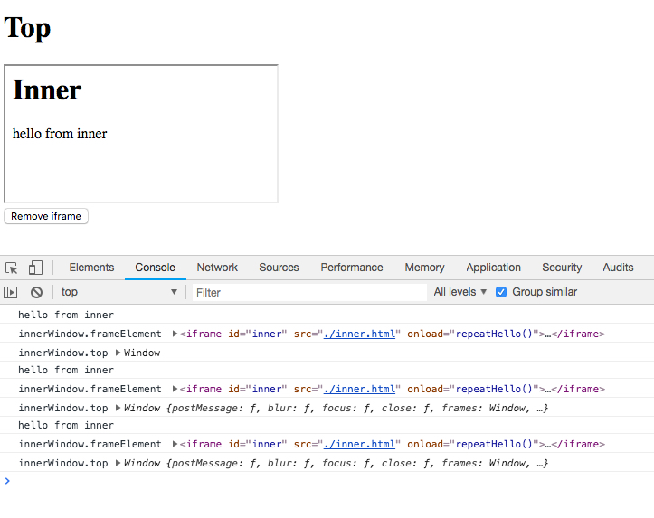
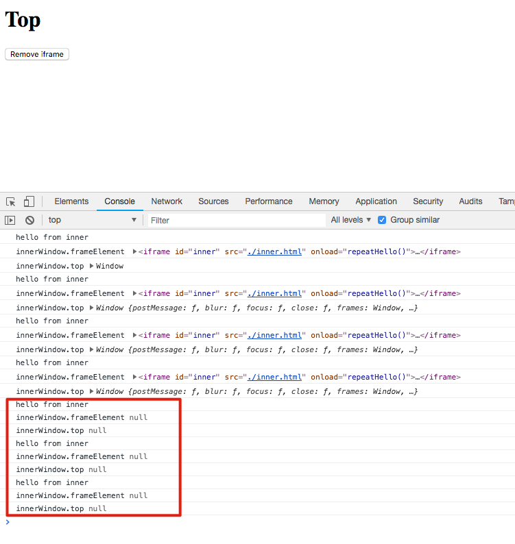

HTML IFrame "window" after Destroyed Demo
==========================================

如果一个iframe从页面中移除了，那么之前取得的它的`contentWindow`还将继续存在，只是其

1. `.frameElement`将变为`null`
2. `.top/.parent`都将为`null`

```
npm run demo
```




